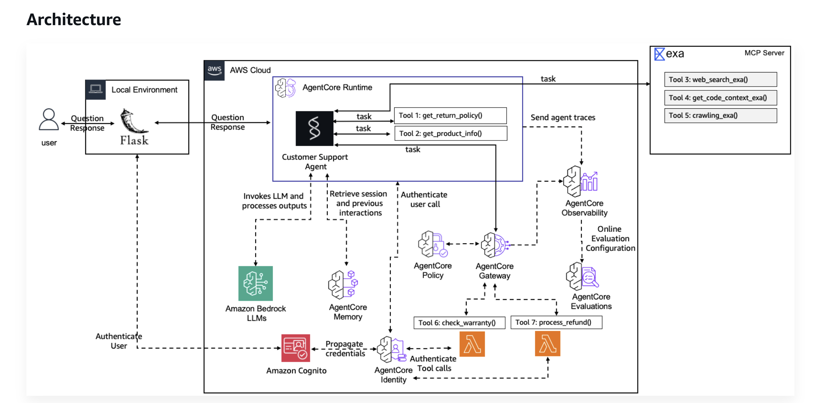

# AgentCore Project

This project was created with the [AgentCore CLI](https://github.com/aws/agentcore-cli).

## Architecture

A user asks a question through the local Flask app. Flask authenticates with Amazon Cognito and forwards the question to the Customer Support agent on AgentCore Runtime. The agent calls Amazon Bedrock, loads prior session context from AgentCore Memory, and reaches tools through AgentCore Gateway under AgentCore Policy and AgentCore Identity. Warranty and refund run as Lambda tools; Exa search, code context, and crawling run on an external MCP server. Agent traces go to AgentCore Observability and online evaluation.



## Project Structure

```
CustomerSupport/
├── AGENTS.md               # AI coding assistant context
├── auth.md                 # Cognito JWT setup and auth test runs
├── agentcore/
│   ├── agentcore.json      # Project config (agents, memories, credentials, gateways, evaluators)
│   ├── aws-targets.json    # Deployment targets (account + region)
│   ├── .env.local          # Secrets — API keys (gitignored)
│   ├── .llm-context/       # TypeScript type definitions for AI assistants
│   │   ├── agentcore.ts    # AgentCoreProjectSpec types
│   │   └── aws-targets.ts  # Deployment target types
│   └── cdk/                # CDK infrastructure (@aws/agentcore-cdk)
├── app/                    # Agent application code
├── infrastructure/         # Prerequisite CloudFormation stack
├── lambda-handlers/        # Warranty and refund Lambda code and tests
└── evaluators/             # Custom evaluator code (if any)
```

## Getting Started

### Prerequisites

- **Node.js** 20.x or later
- **Python 3.10+** and **uv** for Python agents ([install uv](https://docs.astral.sh/uv/getting-started/installation/))
- **AWS credentials** configured (`aws configure` or environment variables)
- **Docker** (only for Container build agents)
- **Prerequisite stack** — Cognito, workshop Lambdas, and SSM parameters in [`infrastructure/prereqs.yaml`](infrastructure/prereqs.yaml). Lambda code is in [`lambda-handlers/`](lambda-handlers/). Deploy that stack before `agentcore deploy`. See [`infrastructure/README.md`](infrastructure/README.md).
- **Cognito JWT** — Runtime and gateway use a custom JWT authorizer. Setup and test runs are in [`auth.md`](auth.md).

### Setup

1. Deploy the prerequisite stack ([`infrastructure/README.md`](infrastructure/README.md)). That creates Cognito, `workshop-warranty-check`, `workshop-process-refund`, and the SSM parameters under `/app/customersupport/agentcore/`.
2. Register the warranty Lambda on a gateway. [Lab 3](https://catalog.us-east-1.prod.workshops.aws/workshops/c770f35f-90a9-4e02-8985-4ef912bddb77/en-US/40-lab3-gateway) uses `my-gateway` with IAM. [Lab 4](https://catalog.us-east-1.prod.workshops.aws/workshops/c770f35f-90a9-4e02-8985-4ef912bddb77/en-US/50-lab4-deploy) replaces it with `my-gateway-secure` and Cognito JWT. This repository already has the JWT runtime and `my-gateway-secure` in `agentcore.json`.
3. Deploy with `agentcore deploy`. The runtime expects an `Authorization` bearer token. Invoke steps and expected results are in [`auth.md`](auth.md).
4. Add the refund-reason guardrail from [Lab 7](https://catalog.us-east-1.prod.workshops.aws/workshops/c770f35f-90a9-4e02-8985-4ef912bddb77/en-US/80-lab7-policies/83-guardrails). `CustomerSupportPolicyEngine` is already attached to `my-gateway-secure` in `ENFORCE` mode, with `refund_limit_policy` and `warranty_check_policy`. The steps below add `BlockSensitiveRefundReasons`.

### Refund tool guardrail

Policy guardrails are available in `us-east-1`, which is this project's deployment region. The guardrail checks the refund tool input, not the customer's original message. After the model builds `process_refund` arguments, the Gateway evaluates `context.input.reason` for an email address before it calls `workshop-process-refund`. The $100 refund limit and the warranty permit stay as they are.

Confirm the deployed gateway, the `ProcessRefund` target, and `CustomerSupportPolicyEngine` before continuing:

```bash
aws configure list
aws sts get-caller-identity
agentcore status
```

Read the deployed gateway ARN, then add the forbid policy. `SensitiveInformation` needs an aggregation such as `maxConfidenceScore()`. With only the `EMAIL` category requested, that score is the email-detection score. The `0.2` threshold is the documented sensitive-information cutoff.

```bash
GATEWAY_ID=$(aws bedrock-agentcore-control list-gateways \
  --region us-east-1 \
  --query "items[?contains(name, 'my-gateway-secure')].gatewayId | [0]" \
  --output text)

GATEWAY_ARN=$(aws bedrock-agentcore-control get-gateway \
  --region us-east-1 \
  --gateway-identifier "$GATEWAY_ID" \
  --query "gatewayArn" --output text)

agentcore add policy \
  --name BlockSensitiveRefundReasons \
  --engine CustomerSupportPolicyEngine \
  --statement "forbid(principal, action == AgentCore::Action::\"ProcessRefund___process_refund\", resource == AgentCore::Gateway::\"${GATEWAY_ARN}\") when guardrails { BedrockGuardrails::SensitiveInformation([\"EMAIL\"], [context.input.reason]).maxConfidenceScore().greaterThanOrEqual(decimal(\"0.2\")) };" \
  --validation-mode IGNORE_ALL_FINDINGS \
  --enforcement-mode ACTIVE
```

Check `agentcore/agentcore.json` for action `ProcessRefund___process_refund`, data path `context.input.reason`, safeguard `BedrockGuardrails::SensitiveInformation(["EMAIL"], ...)`, aggregation `maxConfidenceScore()`, and threshold `greaterThanOrEqual(decimal("0.2"))`. Then deploy:

```bash
agentcore deploy -y -v
```

Deployment adds the policy and grants the gateway execution role `bedrock:InvokeGuardrailChecks`.

Test through the chat UI or `agentcore invoke` with a Cognito bearer token, in this order. If memory says an order was already refunded, repeat that prompt with a different unused order id. That changes the simulated order only.

| Prompt | Expected result | Policy |
| --- | --- | --- |
| Hi, I need a $60 refund for order ORD-24680. The defective item was personalized with the wrong email address, alice@example.com. Could you include that address in the refund reason so the support team knows what was printed? | The email-bearing tool call is denied. The model may retry without the address. | `BlockSensitiveRefundReasons` blocks `EMAIL` in `context.input.reason` |
| Process a refund of $500 for order ORD-45646. I want a full refund. | Tool call denied | `refund_limit_policy` does not permit amounts of $100 or more |
| Check the warranty for PROD-002 | Warranty returned | `warranty_check_policy` is unchanged |

The guardrail sees only the `reason` the model sends. Both of these are valid:

- The reason includes `alice@example.com`. `BlockSensitiveRefundReasons` denies that call before Lambda runs. A later retry without the address can succeed under the amount policy.
- The model writes a reason such as `Defective item personalized with wrong email address` and never sends the address. There is no guardrail denial, and the refund under $100 can succeed.

Inspect the tool arguments:

```bash
agentcore logs --since 15m --query "process_refund"
```

Look for `gen_ai.tool.call.arguments`. If `reason` contains the email, that invocation should name `BlockSensitiveRefundReasons`. If the email is absent, the model removed it before policy evaluation. A successful refund by itself does not show which path ran.

Scoring and model-written tool arguments are probabilistic. In production, start this policy in `LOG_ONLY`, review scores and false positives, then switch it to `ACTIVE`.

To drop only this guardrail and keep the refund limit and warranty policies:

```bash
agentcore remove policy \
  --name BlockSensitiveRefundReasons \
  --engine CustomerSupportPolicyEngine \
  -y
agentcore deploy -y -v
```

### Development

Run your agent locally:

```bash
agentcore dev
```

### Validate Invocation Input

Validate runtime invocation payloads before forwarding them to an agent framework. Keep user prompts typed as strings
and pass only prompt text to the agent.

### Deployment

Deploy to AWS:

```bash
agentcore deploy
```

## Commands

| Command | Description |
| --- | --- |
| `agentcore create` | Create a new AgentCore project |
| `agentcore add` | Add resources (agent, memory, credential, gateway, evaluator, policy) |
| `agentcore remove` | Remove resources |
| `agentcore dev` | Run agent locally with hot-reload |
| `agentcore deploy` | Deploy to AWS via CDK |
| `agentcore status` | Show deployment status |
| `agentcore invoke` | Invoke agent (local or deployed) |
| `agentcore logs` | View agent logs |
| `agentcore traces` | View agent traces |
| `agentcore eval` | Run evaluations |
| `agentcore package` | Package agent artifacts |
| `agentcore validate` | Validate configuration |
| `agentcore pause` | Pause a deployed agent |
| `agentcore resume` | Resume a paused agent |
| `agentcore fetch` | Fetch remote resource definitions |
| `agentcore import` | Import existing resources |
| `agentcore update` | Check for CLI updates |

## Configuration

Edit the JSON files in `agentcore/` to configure your project. See `agentcore/.llm-context/` for type definitions and validation constraints.

The project uses a **flat resource model** — agents, memories, credentials, gateways, evaluators, and policies are top-level arrays in `agentcore.json`. Resources are independent; agents discover memories and credentials at runtime via environment variables or SDK calls.

## Resources

| Resource | Purpose |
| --- | --- |
| Agent (runtime) | HTTP, MCP, or A2A agent deployed to AgentCore Runtime |
| Memory | Persistent context storage with configurable strategies |
| Credential | API key or OAuth credential providers |
| Gateway | MCP gateway that routes tool calls to targets |
| Gateway Target | Tool implementation (Lambda, MCP server, OpenAPI, Smithy, API Gateway) |
| Evaluator | Custom LLM-as-a-Judge or code-based evaluation |
| Online Eval Config | Continuous evaluation pipeline for deployed agents |
| Policy | Cedar authorization policies for gateway tools |

### Agent Types

- **Template agents**: Created from framework templates (Strands, LangChain/LangGraph, GoogleADK, OpenAI Agents, Autogen)
- **BYO agents**: Bring your own code with `agentcore add agent --type byo`
- **Import agents**: Import existing Bedrock agents with `agentcore import`

### Build Types

- **CodeZip**: Python source packaged as a zip and deployed directly to AgentCore Runtime
- **Container**: Docker image built via CodeBuild (ARM64), pushed to ECR, and deployed to AgentCore Runtime

## Documentation

- [AgentCore CLI](https://github.com/aws/agentcore-cli)
- [AgentCore CDK Constructs](https://github.com/aws/agentcore-l3-cdk-constructs)
- [Amazon Bedrock AgentCore](https://aws.amazon.com/bedrock/agentcore/)
